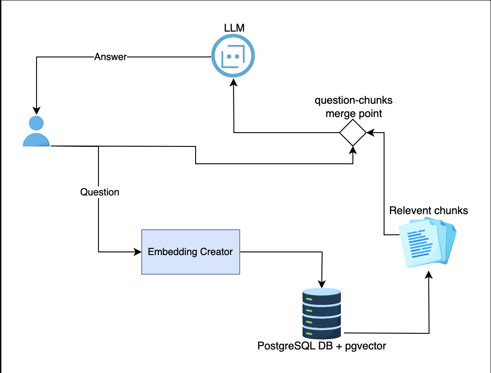
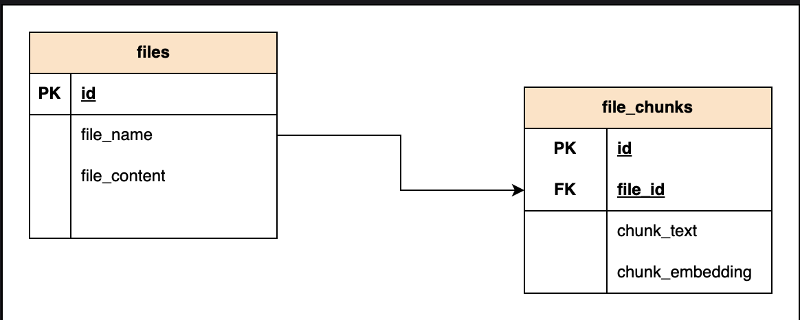

# RAG FastAPI Project

## Architecture



The system uses a Retrieval-Augmented Generation (RAG) pattern with:

- **Embedding Creator**: Converts user questions into embeddings
- **PostgreSQL + pgvector**: Stores and retrieves document chunks using vector similarity
- **LLM**: Generates answers by combining the question with relevant chunks

## Setup

1. Install dependencies:

```bash
pip install -r requirements.txt
```

2. Run the server:

```bash
uvicorn main:app --reload
```

## Endpoints

- `GET /` - Returns service status and health check
- `POST /uploadfile/` - Upload a file to the `sources/` directory

## Testing with curl

```bash
# Test root endpoint
curl http://localhost:8000/

# Test file upload endpoint
curl -X 'POST' 'http://localhost:8000/uploadfile/' -F 'file=@filename.txt'

# Test the open API ask endpoint
curl -X POST "http://127.0.0.1:8000/ask/" \
  -H "accept: application/json" \
  -H "Content-Type: application/json" \
  -d '{
    "question": "What is the capital of France?"
  }'
```

## Environment Setup

1. Copy your OpenAI API key to the `.env` file:

```bash
# Edit .env file and replace with your actual API key
OPENAI_API_KEY=your_openai_api_key_here
```

**Important:** Never commit your actual API key to version control. The `.env` file is already in `.gitignore`.

## API Documentation

FastAPI automatically generates interactive API documentation:

- Swagger UI: http://localhost:8000/docs
- ReDoc: http://localhost:8000/redoc

## Key Takeaways

Run the parser test: /opt/anaconda3/bin/python test_parser.py

1. Factory Pattern - One interface to get the right parser: ParserFactory.get_parser('pdf')
2. Dual approach for PDFs:

- First tries direct text extraction (faster)
- Falls back to OCR for scanned PDFs (slower but works on images)

3. PyMuPDF vs PyPDF2:

- PyPDF2: Text extraction from digital PDFs
- PyMuPDF (fitz): Converts PDF pages to images for OCR

4. OCR pipeline: PDF → Image (pixmap) → PIL Image → Tesseract → Text

The OCR result shows some character recognition quirks (like "Il" instead of "II"), which is typical for OCR - it's not perfect but gets most of the text!

# Database Schema



files table: holds data for each file

file_chunks table: breaks table into chunks and embeddings for 1536-dimensional vector (OpenAI embedding size)

## Why break files into chunks?

- Large files are split into smaller chunks
- Each chunk gets an embedding
- Enables semantic search on smaller pieces
